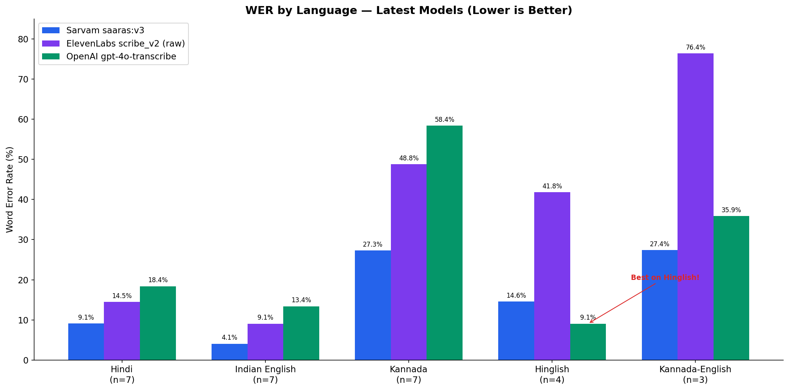
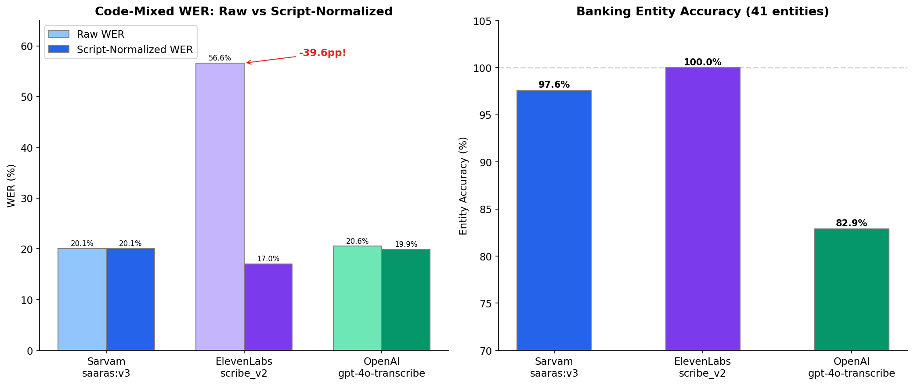
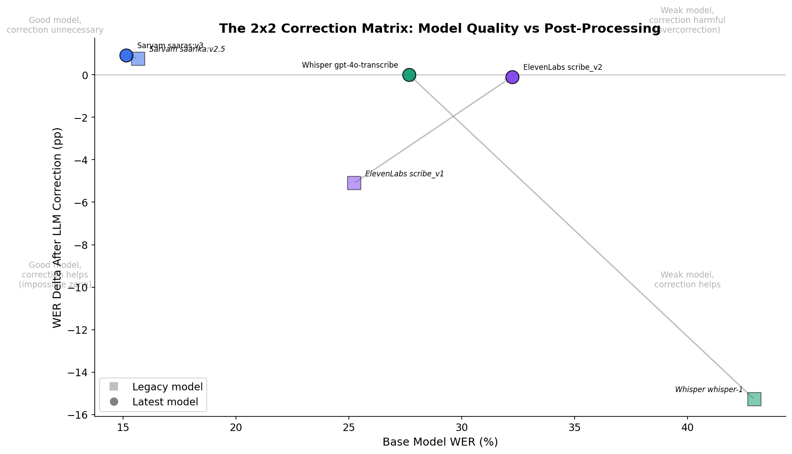
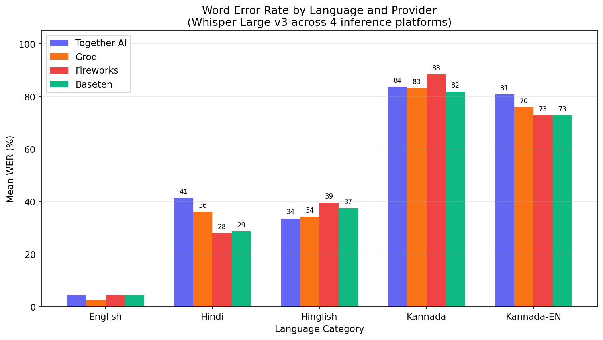
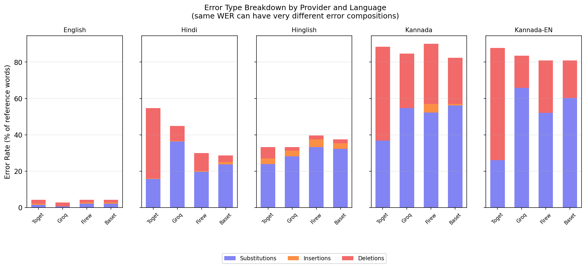
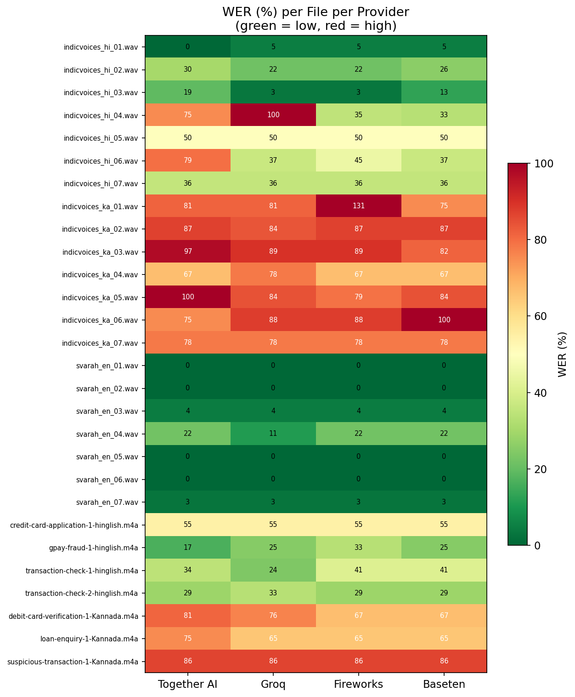
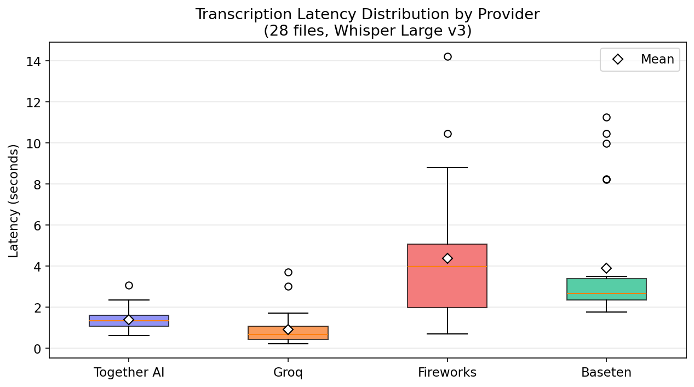
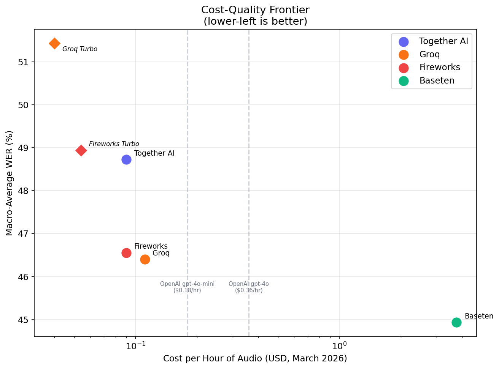

# Evaluating ASR Models

After building a [local speech-to-text app](https://github.com/R-eehan/vox), I wanted to understand: how do you evaluate a model that has no system prompt? With typical LLM features/products involving text generation, you can perform error analysis, build LLM judges, and iterate on system prompts. Most ASR models don't work that way. Some newer models (Azure LLM Speech, Gemini) are starting to accept instructions, but the providers I tested here offer no meaningful prompt control. Audio goes in, text comes out.

This project is an attempt to evaluate three ASR providers against a real enterprise problem: **customer support using voice AI for Indian banking**. The RBI Ombudsman received [1.3 million escalated banking complaints in FY 2024-25](https://rbi.org.in/Scripts/AnnualReportPublications.aspx), up 68% in two years, and that's just the fraction customers escalate formally. Customers naturally code-mix (switch between different languages), making speech transcription a hard problem. In banking, getting "Rs 18,500" right matters more than transcribing every filler word.

**[Interactive code walkthrough](https://r-eehan.github.io/asr-evaluation-exploration/code-walkthrough.html)** : annotated pipeline architecture explaining design decisions.

## Key metrics for ASR evaluation

**1. Word Error Rate(WER)**: Measures the general accuracy of a transcript. It counts how many words the AI got wrong (by swapping, adding, or missing them) compared to what was actually said. Lower scores = better ASR model. Example:

- Human said: "I want to ***close my account***."
- AI heard: "I want to ***clothes my amount***."

The AI got 2 words wrong out of 5; WER = 40%

**2. Character Error Rate(CER)**: Double clicks on character level accuracy. A word comprises of many characters, this metric measures accuracy of each character transcribed in that word from an input audio. **Preferred metric** for Indic/multilingual languages and very useful for checking if the AI is misspelling names or technical terms by just one or two letters. Example:

- Human said: "My name is Smyth."
- AI heard: "My name is Smith."

The actual word(name) is wrong, but only one letter (character) is incorrect across 17 characters(includes spaces, punctuation); CER = 5.8%

**3. Entity Accuracy**: Think of this as a "Meaning Score." For the banking domain, specific details like an Account Number, a Date, or a Transaction Type are called "entities". Entity Accuracy measures if the ASR model successfully identified the "VIP" information needed to actually solve the customer's problem. Example:

The use case: A customer calls a bank’s Voice AI to report a lost card.
The sentence: "I lost my Visa credit card ending in 4242."
Entity Accuracy check:

- Did the AI catch the card type? (Visa credit): Let's say "yes"
- Did the AI catch the last 4 digits? (4242): Let's say 'no'

Entity accuracy: 50% in this specific example

Why it matters: Even if the AI misses a small word like "the" or "uhm" (which affects Word Error Rate), as long as it gets the Entity Accuracy right, the bank can still lock the correct card and help the customer.

### Benchmarks


| Language                 | Acceptable WER | Acceptable CER | Industry Standard Note                            |
| ------------------------ | -------------- | -------------- | ------------------------------------------------- |
| English (General)        | 5% – 8%        | 2% – 5%        | The "Gold Standard" due to massive datasets       |
| Hindi (Indic)            | 15% – 20%      | 5% – 10%       | Acceptable range for high-performing Indic models |
| Dravidian (Tamil/Telugu) | 20% – 35%      | 10% – 15%      | Higher WER due to long, complex word structures   |


## Key Findings

**1. There is no "best" model.** Sarvam leads overall WER (15%). OpenAI wins Hinglish code-mixed (9%). ElevenLabs scores 100% on banking entity accuracy. The right choice depends on what you're optimizing for.

**2. Script normalization inflates WER by 40 percentage points.** ElevenLabs outputs English loanwords in Latin script while ground truth uses Devanagari. Raw WER: 57%. After normalizing scripts: 17%. Without this correction, you'd wrongly conclude the model can't handle code-mixing. This was the single most important discovery in the project.

**3. Model quality beats post-processing.** Upgrading from whisper-1 to gpt-4o-transcribe cut 15pp of WER. That's the same improvement as building an entire LLM correction pipeline, but at zero marginal cost. When the base model is strong enough (Sarvam), LLM correction actually makes things worse by overcorrecting.

**4. The Kannada gap is 3x.** Even Sarvam, the "Indic-first" provider, hits 27% WER on Kannada vs 9% on Hindi. If you're building voice AI for Karnataka's banks, "Indic-first" alone won't guarantee your language works.

## Results at a Glance

### Latest Models, Overall Performance


| Provider   | Model             | WER        | CER       | Entity Accuracy | Latency (P50) |
| ---------- | ----------------- | ---------- | --------- | --------------- | ------------- |
| **Sarvam** | saaras:v3         | **15.14%** | **6.67%** | 97.6%           | **0.84s**     |
| ElevenLabs | scribe_v2         | 32.23%     | 20.76%    | **100%**        | 1.14s         |
| OpenAI     | gpt-4o-transcribe | 27.68%     | 14.61%    | 82.9%           | 1.86s         |


### WER by Language



### Script Normalization Impact + Entity Accuracy



### Model Quality vs Post-Processing (The Correction Matrix)



## Methodology

### Test Data (n=28)


| Source                                                                   | Files | Languages                         | Content                                        |
| ------------------------------------------------------------------------ | ----- | --------------------------------- | ---------------------------------------------- |
| [IndicVoices-R](https://huggingface.co/datasets/ai4bharat/indicvoices_r) | 14    | Hindi (7), Kannada (7)            | Natural speech from diverse speakers           |
| [Svarah](https://huggingface.co/datasets/ai4bharat/Svarah)               | 7     | Indian English                    | Accented English queries                       |
| Personal recordings                                                      | 7     | Hinglish (4), Kannada-English (3) | Code-mixed banking scenarios I recorded myself |


### Providers Tested

- **Sarvam AI** : saaras:v3 (latest) + saarika:v2.5 (legacy)
- **ElevenLabs** : scribe_v2 (latest) + scribe_v1 (legacy)
- **OpenAI** : gpt-4o-transcribe (latest) + whisper-1 (legacy)

### Caveats

This is a directional evaluation, not a statistically significant benchmark. n=28 is too small for definitive conclusions. The public dataset audio covers general topics (cooking, sports), not banking-specific conversations. Code-mixed recordings are personal (confound: speaker identity vs. code-mixing difficulty). These findings suggest patterns worth investigating at scale.

## Architecture

```
[Audio Files] → [Provider Abstraction] → [Evaluation Runner] → [Metrics Engine] → [Results]
                 src/providers/           src/run_eval.py        src/metrics/        data/results/
                                                                      ↓
                                                              [Text Normalization]
                                                               src/metrics/normalize.py
                                                               src/metrics/script_normalize.py
                                                                      ↓
                                                              [Post-ASR Correction PoC]
                                                               src/correction/
```


| File                                  | Purpose                                                                                         |
| ------------------------------------- | ----------------------------------------------------------------------------------------------- |
| `src/run_eval.py`                     | Main evaluation runner. Loads ground truth, loops providers, computes metrics, saves results.   |
| `src/providers/sarvam.py`             | Sarvam API wrapper (REST, custom auth header, MIME workaround)                                  |
| `src/providers/elevenlabs_stt.py`     | ElevenLabs SDK wrapper (word-level timestamps, logprobs)                                        |
| `src/providers/whisper.py`            | OpenAI Whisper/GPT-4o wrapper                                                                   |
| `src/metrics/wer.py`                  | Word Error Rate via jiwer with Indic text normalization                                         |
| `src/metrics/cer.py`                  | Character Error Rate via jiwer                                                                  |
| `src/metrics/normalize.py`            | Indic text normalization. Nuqta stripping, chandrabindu handling, punctuation across 3 scripts. |
| `src/metrics/script_normalize.py`     | Latin-to-native script mapping for code-mixed WER fairness                                      |
| `src/correction/llm_correction.py`    | GPT-based banking domain correction (full-transcript + targeted modes)                          |
| `src/correction/confidence_guided.py` | ElevenLabs logprob-guided correction with fallback for uncalibrated confidence                  |
| `src/config.py`                       | Environment and path configuration                                                              |
| `scripts/download_data.py`            | Fetch audio from HuggingFace datasets                                                           |
| `analysis/visualizations.ipynb`       | Chart generation notebook (run to regenerate all figures)                                       |


## Quick Start

```bash
# Clone
git clone https://github.com/R-eehan/asr-evaluation-exploration.git
cd asr-evaluation-exploration

# Setup
cp .env.template .env
# Add your API keys to .env (Sarvam, ElevenLabs, OpenAI)

pip install -r requirements.txt

# Run evaluation (all 28 files, all 3 providers)
python src/run_eval.py

# Run with a subset
python src/run_eval.py --limit 5
```

Audio files are included in the repo. To re-download from HuggingFace (requires HF token for gated datasets):

```bash
python scripts/download_data.py
```

---

## Part 2: Does the Inference Platform Matter?

[Wispr Flow](https://www.wispr.ai/) [runs Whisper on Baseten](https://www.baseten.co/resources/customers/wispr-flow/). That's the app that got me intrigued with speech-to-text in the first place. So after Part 1, I had a follow up question: if I deploy the exact same Whisper model on Baseten, Together AI, Groq, and Fireworks AI, do I get the same transcription & results?

Short answer: **no.** Same model, same input file - observed up to 67 percentage points of WER divergence on challenging Hindi and Kannada audio. The platforms agreed on easy English audio and disagreed on everything hard.

There's prior work suggesting this should happen. An [ICLR 2025 paper](https://arxiv.org/abs/2410.20247) tested Llama models across 31 API endpoints and found 11 deviate from reference weights due to undisclosed optimizations. [Artificial Analysis](https://artificialanalysis.ai/speech-to-text/models/whisper) shows different WER for the same Whisper model across providers, but only publishes aggregate numbers, not raw transcription diffs. 

I wanted to see the actual transcriptions side by side, on Indic and code-mixed audio where accuracy margins are already tight.

### What I tested

Same 28 audio files from Part 1, same ground truth. Four inference platforms, all serving Whisper Large v3 (1.55B parameters):


| Platform     | Type                  | How it serves Whisper                   | Cost/hr |
| ------------ | --------------------- | --------------------------------------- | ------- |
| Together AI  | Managed inference API | OpenAI-compatible endpoint              | $0.09   |
| Groq         | Managed inference API | Custom LPU hardware (not GPU)           | $0.111  |
| Fireworks AI | Managed inference API | OpenAI-compatible endpoint              | $0.09   |
| Baseten      | Self-deployed         | I deployed the model on an H100 MIG GPU | ~$3.75  |


I set `temperature=0` on all providers, passed explicit language codes, and sent the same unmodified audio files. To confirm the platforms are **deterministic**, I ran 4 representative files across all providers 3 times. Every provider returned identical output on each repeat. Any differences across platforms are real, not random noise.

### Key Findings (Part 2)

**1. Platform choice matters on hard audio**

WER for 13/28 files had all 4 providers **within 5 percentage points** of each other. Mostly English and straightforward Hindi. Any provider works for clean audio.

WER for 9 files diverged **by more than 15 percentage points.** These were accented Hindi, Kannada, and code-mixed speech. On one Hindi file, Groq scored 100% WER (hallucinated in English mid-sentence) while Baseten scored 33%. Same model, same audio file.

**The takeaway**: What inference platform you choose depends on your use case. If your product handles easy audio, you could pick the cheapest provider. If your product handles the hard cases, your choice of platform may affect quality & pricing can't be your only factor.



**2. Models deployed on Inference providers fail in different ways, even when WER looks similar**

On Hindi, Together AI had a **38.6% word deletion rate**. It was dropping words and producing shorter transcripts. Groq had a **36.3% word substitution rate**. It replaced words with wrong ones but kept the transcript roughly the same length.

For a banking product, a provider that silently drops "eighteen thousand five hundred" is a **different risk than one that misspells it**. WER alone doesn't capture this. You need to look at the error composition.



**3. Script normalization inflates Hinglish WER. Kannada WER is genuinely high.**

Same finding as Part 1, now confirmed across 4 more providers. Model deployed on all platforms output English loanwords in Roman script ("credit card") while my ground truth uses Devanagari ("क्रेडिट कार्ड"). After normalizing scripts, 13/16 Hinglish provider-file pairs improved. One file dropped from 54.5% to 13.6% WER. That 41pp gap was measurement related, not a model/inference platform quality problem.

Kannada-English normalization had zero effect. The 65-87% WER on Kannada is real. Whisper Large v3 struggles with Dravidian languages regardless of which platform serves it.

**4. We can observe & verify outputs varying for models deployed on different inference platform. Identifying the "why" is hard**

There are four documented reasons inference platforms can produce different output from the same model: different quantization levels (FP16 vs INT8), different inference engines (vLLM vs TensorRT-LLM vs Groq's custom LPU), GPU floating-point non-determinism ([>98% of tokens match, ~2% diverge](https://adamkarvonen.github.io/machine_learning/2025/11/28/difr.html)), and different decoding configurations (beam width, VAD, audio preprocessing).

Without access to provider internals, isolating which cause is responsible for what is hard. The finding is: "same model name, different output." 

### Results at a Glance (Part 2)

WER is reported per language category. I don't report a single overall WER because the language mix in the test set (7 Hindi, 7 Kannada, 7 English, 4 Hinglish, 3 Kannada-English) would **bias the aggregate**. The macro-average below is the mean of per-category means, giving each language equal weight.


| Provider    | English | Hindi | Hinglish | Kannada | Kn-EN | Macro-Avg |
| ----------- | ------- | ----- | -------- | ------- | ----- | --------- |
| Baseten     | 4.2%    | 28.6% | 37.4%    | 81.8%   | 72.7% | 44.9%     |
| Groq        | 2.6%    | 36.1% | 34.3%    | 83.1%   | 75.9% | 46.4%     |
| Fireworks   | 4.2%    | 28.0% | 39.5%    | 88.4%   | 72.7% | 46.6%     |
| Together AI | 4.2%    | 41.4% | 33.6%    | 83.6%   | 80.8% | 48.7%     |




### Latency

Groq is **4-5x faster than the other providers**. This is hardware, not software. Groq runs on custom LPU silicon designed for inference, not GPUs. Fireworks and Baseten had tail latency spikes up to 14 seconds on some files.



### Cost at Scale (March 2026 pricing)


| Provider             | 100 hrs/mo | 1,000 hrs/mo | 10,000 hrs/mo |
| -------------------- | ---------- | ------------ | ------------- |
| Groq Turbo           | $4         | $40          | $400          |
| Fireworks Turbo      | $5         | $54          | $540          |
| Together AI          | $9         | $90          | $900          |
| Fireworks            | $9         | $90          | $900          |
| Groq (Large v3)      | $11        | $111         | $1,110        |
| OpenAI (gpt-4o-mini) | $18        | $180         | $1,800        |
| OpenAI (gpt-4o)      | $36        | $360         | $3,600        |
| Baseten (H100 MIG)   | $375       | $3,750       | $37,500       |


Baseten's cost assumes a dedicated H100 MIG at $0.0625/GPU-min. At high utilization with consistent load, the effective per-audio cost drops. At low utilization with idle GPU time, it's the most expensive option. All pricing verified from provider websites, March 2026. Treat these numbers as perishable.



### Deploying on Baseten: what I learned

I deployed Whisper on Baseten three times before getting it right.

1. **First attempt**: Deployed "Whisper Large v3 Turbo Streaming." This is a WebSocket model designed for live microphone input. It expects raw PCM chunks over a persistent connection. Wrong serving method for evaluating pre-recorded files.
2. **Second attempt**: Deployed "Whisper Large v3 Turbo" (non-streaming, REST API). Correct interface, wrong model. Turbo is 809M parameters, not the 1.55B full model I was comparing against on other platforms.
3. **Third attempt**: Deployed "Whisper Large v3." Correct model, correct interface.

Managed APIs (Together AI, Groq, Fireworks) abstract all of this away. You pass a model name and get results. Baseten gives you control over GPU choice, autoscaling, and dedicated instances, but it expects you to understand what you're deploying. The streaming vs batch confusion and the model variant mismatch are the kind of mistakes a first-time deployer makes. I made both.

### How to evaluate inference providers for your use case

The code in this repo is open-source and provider-agnostic. Here's the methodology:

1. **Build your eval set.** Representative of your actual audio. Languages, accents, domains, recording quality. Your product's real-world distribution, not a generic benchmark.
2. **Define your ground truth conventions.** What script for multilingual text? Digits or spelled-out numbers? These conventions determine your WER numbers. Make them explicit, because changing them changes your results.
3. **Run across candidate providers.** Same files, same conditions. Control temperature and language code. Document what you can't control (beam width, audio preprocessing, model checkpoint version).
4. **Compare on your criteria.** WER is one metric. Latency, cost, error type (deletions vs substitutions), entity accuracy, and edge-case behavior all matter depending on your product.
5. **Accept that results are perishable.** Providers update models, pricing, and infrastructure continuously. Your evaluation is a snapshot. Date-stamp everything.

### Methodology and Caveats (Part 2)

**What I controlled**: Whisper Large v3 on all 4 providers (verified mid-project. I caught a model mismatch where some providers were running Turbo instead of Full. Corrected it before running the evaluation). Temperature=0. Explicit language codes. Same audio files, unmodified.

**What I could not control**: Quantization level, inference engine, beam width, audio preprocessing, model checkpoint version. All undisclosed or not configurable via the API.

**Limitations**: Same test set as Part 1 (n=28). Per-language sample sizes range from 3 to 7. These are descriptive findings, not statistically generalizable. Batch mode only. Single evaluation session. Results may vary under different provider load or after provider updates.

### New files added


| File                                 | Purpose                                                                                         |
| ------------------------------------ | ----------------------------------------------------------------------------------------------- |
| `src/providers/together_ai.py`       | Together AI, OpenAI-compatible API                                                              |
| `src/providers/groq_whisper.py`      | Groq, OpenAI-compatible API on custom LPU hardware                                              |
| `src/providers/fireworks_whisper.py` | Fireworks AI, OpenAI-compatible API (different endpoints per model variant)                     |
| `src/providers/baseten_whisper.py`   | Baseten, REST API with base64 audio upload to self-deployed model                               |
| `src/metrics/cost.py`                | Per-request cost calculator based on provider pricing                                           |
| `src/analyze_cross_platform.py`      | Cross-platform analysis: script normalization, entity accuracy, error types, provider agreement |
| `src/visualize_cross_platform.py`    | Figure generation for Part 2                                                                    |
| `scripts/verify_providers.py`        | API key and audio format verification                                                           |


### Updated Quick Start

```bash
# Run evaluation on inference platforms only
python src/run_eval.py --providers together_ai groq fireworks baseten --delay 1.5

# Run with specific files
python src/run_eval.py --providers groq --files indicvoices_hi_01.wav svarah_en_01.wav

# Run Groq Turbo variant
python src/run_eval.py --providers groq --model whisper-large-v3-turbo

# Resume an interrupted run
python src/run_eval.py --providers together_ai groq fireworks baseten --resume data/results/run.jsonl

# Run cross-platform analysis on results
python -m src.analyze_cross_platform --results data/results/eval_results_cross_platform_v1_*.csv
```

## Attribution

Audio data from [IndicVoices-R](https://huggingface.co/datasets/ai4bharat/indicvoices_r) and [Svarah](https://huggingface.co/datasets/ai4bharat/Svarah) by AI4Bharat (IIT Madras), released under CC-BY-4.0. See [ATTRIBUTION.md](ATTRIBUTION.md) for full citation details.

## License

MIT